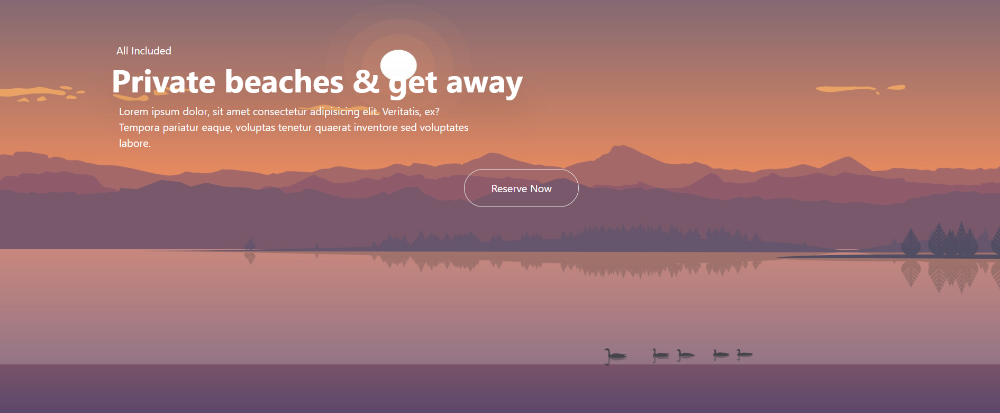

<h1 align="center" id="title">WEEKEND-WEBSITE</h1>

<p id="description">Experience timeless elegance with our React-powered website crafted using Tailwind for a classic UI. Seamlessly blending modern technology with traditional design explore effortlessly. Timeless charm awaits.Experience timeless elegance with our React-powered website crafted using Tailwind for a classic UI. Seamlessly blending modern technology with traditional design explore effortlessly. Timeless charm awaits.</p>

  
  
<h2>🧐 Features</h2>

Here're some of the project's best features:

*   made using Tailwind
*   made using react
*   good started template
*   beginer friendly code

<h2>🛠️ Installation Steps:</h2>

<p>1. Clone the project using this code ..</p>

```
git clone https://github.com/rocker-abhi/Weekend-Website.git
```

<p>2. Change the directory .</p>

```
cd .\Weekend-Website\
```

<p>3. Execute the project using command .</p>

```
npm run dev 
```

  
  
<h2>💻 Built with</h2>

Technologies used in the project:

*   HTML
*   CSS
*   TAILWIND
*   REACT
*   JAVASCRIPT

  
<h2>🧐 Screen Shot </h2>



